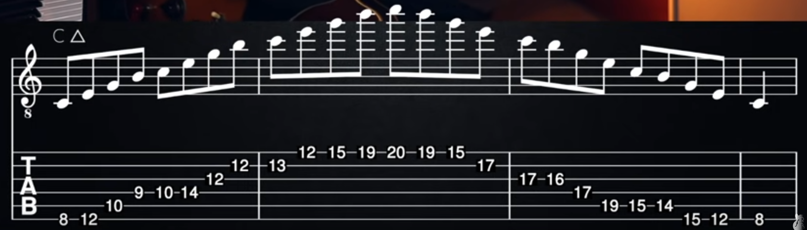
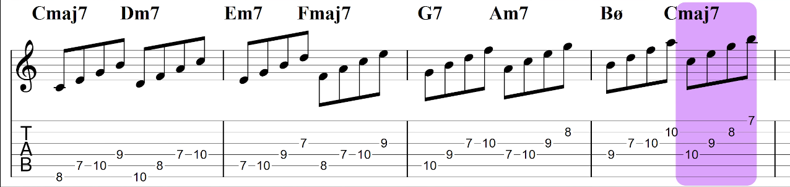

# Arpeggio / Broken Chord / Chordal / Chord Tones
Arpeggio itu ketika nada-nada pada chord (TRIAD) dimainkan secara satu-persatu, atau jika nada-nada chord dimainkan secara acak, biasa disebut broken chord.

### Exercise Extended Chord 7 Arpeggio:
https://www.youtube.com/watch?v=YXM7fhI12sg

#### Exercise 1: CM7 Arpeggio

#### Exercise: 7 Chords Arpeggio - https://youtu.be/TDV25qbNA-A?si=WrUnYpwdcEzy4Pz4&t=220

