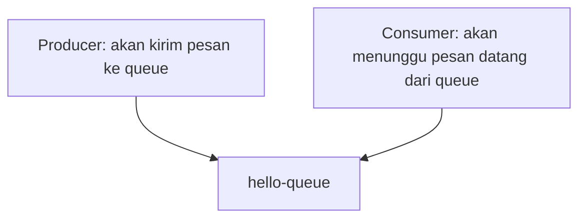

# RabbitMQ simple consumer & producer.

- Producer: aplikasi yang ngirim pesan.
- Consumer: aplikasi yang menerima pesan.
- Producer & Consumer harus connect dengan rabbitmq yang sama dan queue yang sama.
- Producer & Consumer tidak harus di 1 mesin yang sama, yang penting connect ke host rabbitmq yang sama.
- Consumer: kalo mau pake `ch.ConsumeWithContext` make sure gak ada context timeout, soalnya kalo ada timeoutnya, consumer akan berhenti consume message ketika melewati batas timeout.
- Kalo ada multiple consumer, maka message akan diolah secara round-robin.

