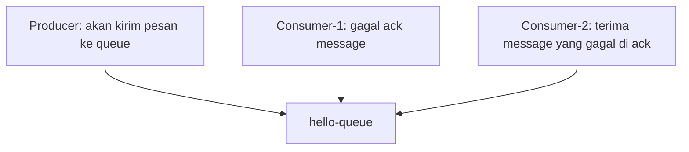

# RabbitMQ Message Acknowledgement.

- Message acknowledgement ini diperlukan, ketika consumer sedang jalan, tetapi sebelum proses selesai terjadi error.
- Jika pake `auto-ack`, message yang sudah diterima consumer akan langsung dihapus dari queue, sedangkan jika ack manual, pesan akan dikembalikan ke queue selama belum di ack di consumer.
  - proses ack manual, bisa menggunakan perintah `d.Ack(false)` ketika process berhasil diproses.
  - ketika ada multiple consumer dan ketika 1 consumer proses message tetapi gagal, maka message akan dilempar ke consumer selanjutnya sampai di ack berhasil.
  - ketika multiple consumer tidak ada yang berhasil ack, maka message akan kembali di re-queue ke queue.
- secara default ack timeout itu 30 menit, untuk memaksa consumer ack message sehingga menghindari bug message stuck yang gak akan pernah di acknowledge.
  - untuk config ack timeout bisa diubah [disini](https://www.rabbitmq.com/docs/consumers#acknowledgement-timeout).

