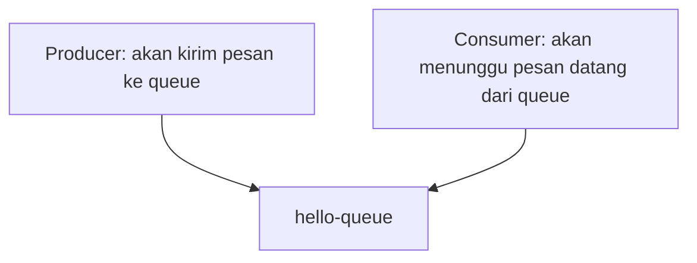

# RabbitMQ simple consumer & producer.

- Producer: aplikasi yang ngirim pesan.
- Consumer: aplikasi yang menerima pesan.
- Producer & Consumer harus connect dengan rabbitmq yang sama dan queue yang sama.
- Producer & Consumer tidak harus di 1 mesin yang sama, yang penting connect ke host rabbitmq yang sama.

